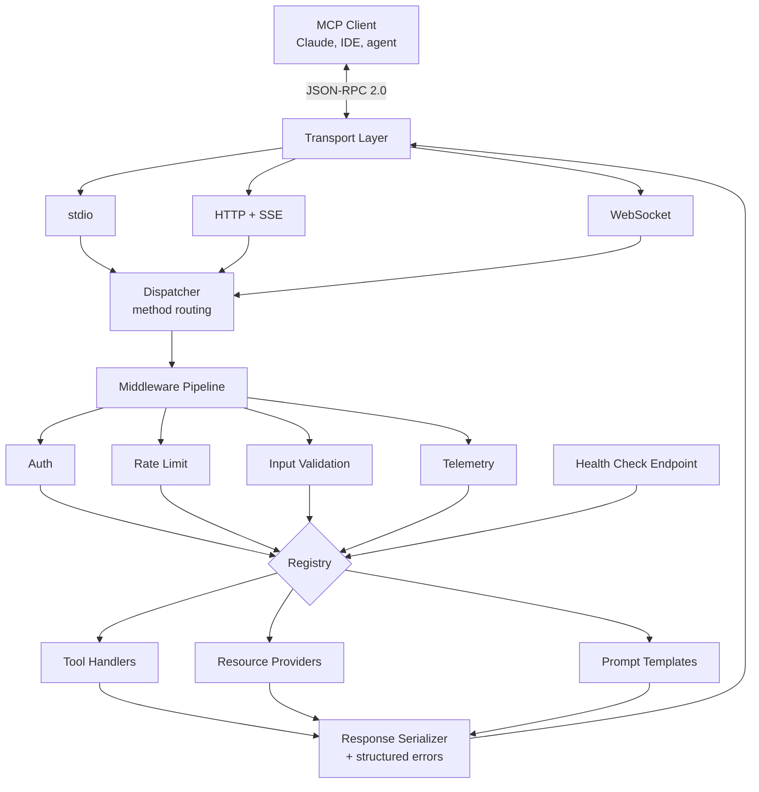
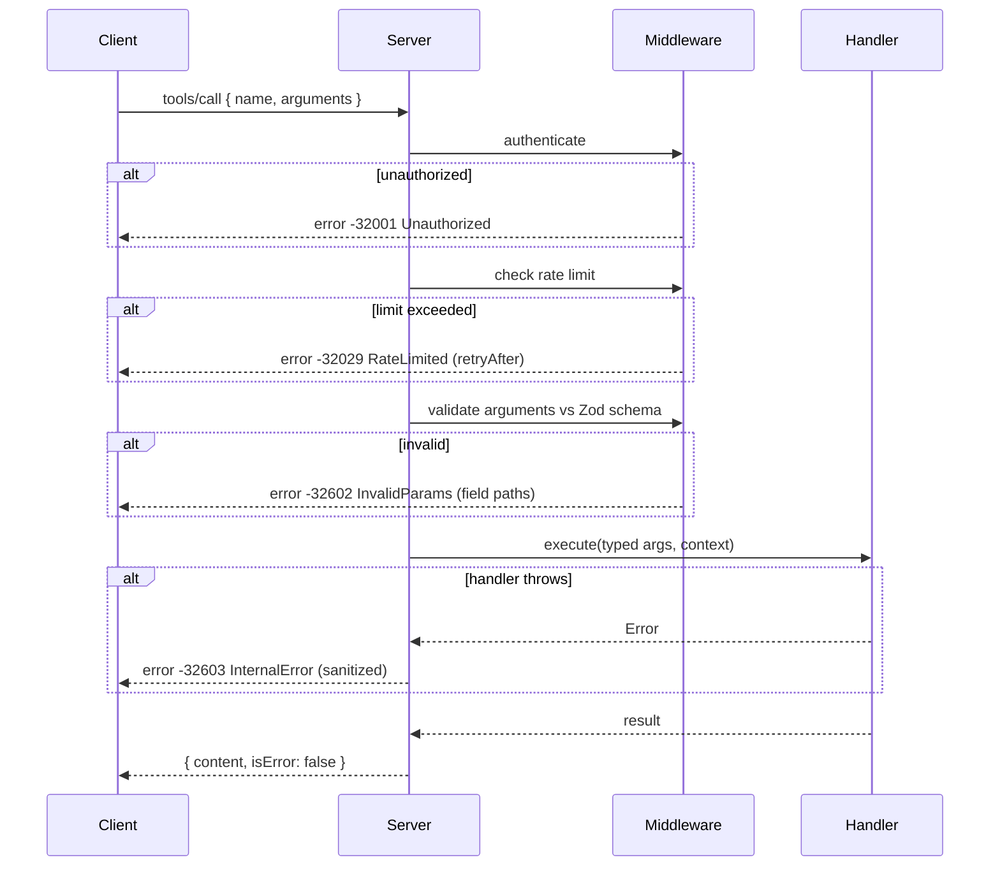

# mcp-toolkit

> Framework for building Model Context Protocol servers: schema generation from TypeScript types, auth middleware, rate limiting, health checks, structured errors, and hot-reload development mode.

[](https://www.typescriptlang.org/)
[](https://nodejs.org/)
[](LICENSE)
[](#project-status)

## Project Status

**Work in progress.** The server core, tool registry, middleware pipeline, and schema derivation from Zod are implemented. Transport adapters and hot-reload are in development.

## What is MCP

The [Model Context Protocol](https://modelcontextprotocol.io) is an open standard that lets AI applications connect to external tools and data sources through a uniform interface. An MCP server exposes **tools** (callable functions), **resources** (readable data), and **prompts** (reusable templates) over JSON-RPC 2.0.

The protocol itself is straightforward. Writing a *production* MCP server is where the work is: schemas must stay in sync with implementations, calls need auth and rate limiting, failures need to be structured rather than thrown strings, and iterating without restarting the process saves hours.

This toolkit handles that layer so a server is mostly the business logic.

## Architecture



### Request Lifecycle



## Features

### Schema Derivation from Zod

Define the input schema once as a Zod object. The toolkit derives the JSON Schema advertised to clients and infers the TypeScript argument type for the handler. There is no separate schema file to drift out of sync with the implementation.

### Middleware Pipeline

Middleware runs in registration order and can short-circuit. Each middleware receives the request plus a mutable context, so auth can attach the resolved user and later middleware or handlers can read it.

### Structured Errors

MCP is JSON-RPC, which defines error codes. The toolkit maps failures to appropriate codes and keeps internal details out of client-facing messages while preserving them in logs.

| Condition | Code | Client sees |
|-----------|------|-------------|
| Unknown tool | `-32601` | Method not found |
| Argument validation failure | `-32602` | Invalid params, with field paths |
| Auth failure | `-32001` | Unauthorized |
| Rate limit exceeded | `-32029` | Rate limited, with `retryAfter` |
| Handler threw | `-32603` | Internal error, details logged not returned |

### Rate Limiting

Token bucket per client identity, with configurable per-tool overrides. An expensive tool can be limited more aggressively than a cheap one, which matters when one tool hits a paid API and another reads a local file.

### Health Checks

A health endpoint reports registry state, dependency reachability, and per-tool error rates. Useful for readiness probes and for noticing that a tool has been silently failing every call for two hours.

## Installation

```bash
npm install @q1-digital/mcp-toolkit
```

## Quick Start

```typescript
import { MCPServer, defineTool } from '@q1-digital/mcp-toolkit';
import { z } from 'zod';

const server = new MCPServer({
  name: 'crm-tools',
  version: '1.0.0',
  transport: 'stdio',
});

server.tool(defineTool({
  name: 'search_contacts',
  description: 'Search CRM contacts by name, email, or company.',
  input: z.object({
    query: z.string().min(1).describe('Search term'),
    limit: z.number().int().min(1).max(100).default(20),
    includeArchived: z.boolean().default(false),
  }),
  // `args` is fully typed from the schema above
  handler: async (args, ctx) => {
    ctx.logger.info('Searching contacts', { query: args.query });

    const contacts = await crm.search({
      term: args.query,
      limit: args.limit,
      archived: args.includeArchived,
    });

    return {
      content: [{
        type: 'text',
        text: contacts.map(c => `${c.name} <${c.email}> @ ${c.company}`).join('\n'),
      }],
    };
  },
}));

server.use(async (req, ctx, next) => {
  const token = req.headers?.authorization?.replace('Bearer ', '');
  const user = token ? await auth.verify(token) : null;
  if (!user) return ctx.unauthorized('Valid bearer token required');
  ctx.user = user;
  return next();
});

server.rateLimit({
  default: { requestsPerMinute: 60 },
  perTool: {
    search_contacts: { requestsPerMinute: 20 },
  },
  identify: (req, ctx) => ctx.user?.id ?? 'anonymous',
});

await server.listen();
```

### Resources

```typescript
server.resource({
  uri: 'crm://contacts/{id}',
  name: 'Contact record',
  mimeType: 'application/json',
  handler: async ({ id }) => {
    const contact = await crm.get(id);
    if (!contact) return null; // becomes a proper not-found response
    return { contents: [{ uri: `crm://contacts/${id}`, text: JSON.stringify(contact) }] };
  },
});
```

### Development Mode

```bash
npx mcp-toolkit dev ./src/server.ts
```

Watches for changes, re-registers tools without dropping the client connection, and validates that every registered schema is well-formed before accepting traffic.

## Configuration

```typescript
interface MCPServerConfig {
  name: string;
  version: string;
  transport: 'stdio' | 'http' | 'websocket';
  http?: { port: number; host?: string; cors?: boolean };
  logging?: { level: 'debug' | 'info' | 'warn' | 'error'; destination?: 'stderr' | 'file' };
  telemetry?: { enabled: boolean; exporterEndpoint?: string };
  health?: { enabled: boolean; path?: string };
}
```

> **Note on stdio:** when using the stdio transport, logs must go to stderr. stdout carries the JSON-RPC stream, and writing anything else there corrupts the protocol. The toolkit enforces this and will refuse a config that sends logs to stdout under stdio.

## Project Structure

```
src/
├── core/
│   ├── server.ts                 # Server lifecycle + registration API
│   ├── dispatcher.ts             # JSON-RPC method routing
│   ├── registry.ts               # Tool / resource / prompt registry
│   └── context.ts                # Per-request context
├── transport/
│   ├── base.transport.ts
│   ├── stdio.transport.ts        # Line-delimited JSON over stdin/stdout
│   ├── http.transport.ts         # HTTP POST + SSE for server-initiated messages
│   └── websocket.transport.ts
├── schema/
│   ├── zod-to-jsonschema.ts      # Schema derivation
│   ├── validator.ts              # Argument validation + error shaping
│   └── introspection.ts          # tools/list, resources/list responses
├── middleware/
│   ├── pipeline.ts               # Ordered execution + short-circuit
│   ├── auth.middleware.ts
│   ├── rate-limit.middleware.ts  # Token bucket
│   └── telemetry.middleware.ts
├── errors/
│   ├── rpc-errors.ts             # JSON-RPC error codes
│   └── sanitizer.ts              # Strip internals from client messages
├── health/
│   └── checker.ts                # Registry + dependency health
├── dev/
│   ├── watcher.ts                # File watching
│   └── reloader.ts               # Hot re-registration
├── cli.ts
└── index.ts
```

## Design Decisions

**Why derive JSON Schema from Zod instead of accepting both?** Two sources of truth for the same contract always diverge. Deriving from Zod means the schema advertised to the client and the type the handler receives cannot disagree, because they come from the same declaration.

**Why can middleware short-circuit rather than only observe?** Auth and rate limiting are inherently gates. Modelling them as observers would require the handler to re-check authorization, which is exactly the duplication middleware exists to remove.

**Why sanitize handler errors?** A stack trace or database error string returned to a client leaks schema names, file paths, and sometimes credentials. The client gets a stable error code; the operator gets the full detail in logs.

**Why per-tool rate limits?** A uniform limit is either too loose for the expensive tool or too tight for the cheap one. Tools have different costs, so they need different budgets.

**Why enforce stderr logging under stdio?** Because a single stray `console.log` silently corrupts the JSON-RPC stream, and the resulting failure mode is confusing enough that it is worth making structurally impossible.

## Roadmap

- [ ] Transport adapters (stdio, HTTP+SSE, WebSocket)
- [ ] Hot-reload with connection preservation
- [ ] Prompt template registry with argument validation
- [ ] Tool composition (call one tool from another with context propagation)
- [ ] OpenAPI import to generate tools from an existing REST API
- [ ] Conformance test suite against the MCP specification

## License

MIT
